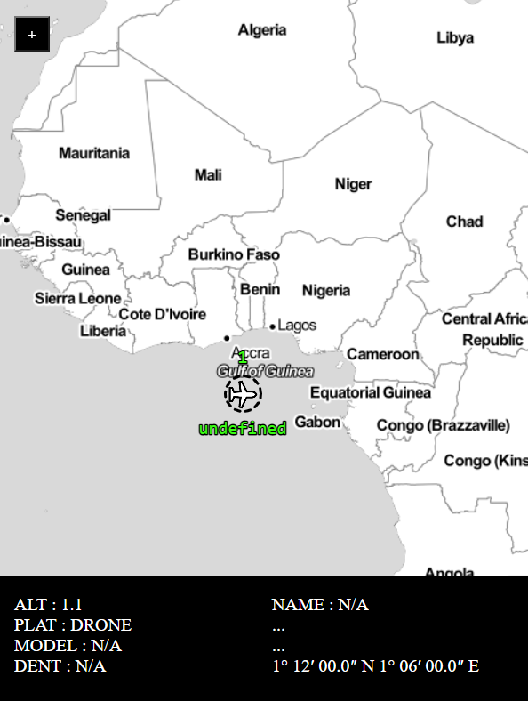

# OpenLayers + Parcel

This example demonstrates how the `ol` package can be used with Parcel.

To get started, run the following (requires Node 12+):

    npx create-ol-app my-app --template parcel

Then change into your new `my-app` directory and start a development server (available at http://localhost:1234):

    cd my-app
    npm start

To generate a build ready for production:

    npm run build

Then deploy the contents of the `dist` directory to your server.

To run the static vector file server:
`nodemon serveStatic.js`

Dependencies
* proj4 - used for WGS84 projection coordinate transformations# MFDU_OpenLayers
* google protobuf
* nodemon
* express
* parcel

# MFDU_OpenLayers
Omitted from the Repo
* GTRI-proprietary software and technology

Uses Parcel to host an OpenLayers application. Serve static .geoJson files from an express server. Receive FACE compliant geographical data through a google protobuf server and parse locally using OpenLayers/Js.
